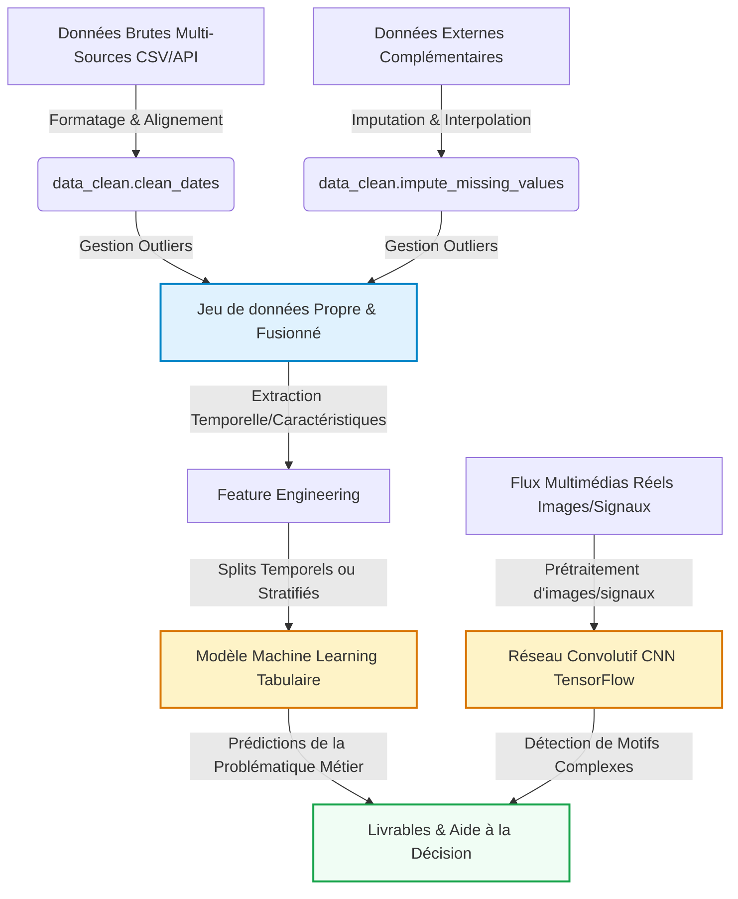

# Mon Projet Data Science
Étudiant(e) 1 :celia merabet  
Étudiant(e) 2 : Abderrahmane Karim RAKEM   
Étudiant(e) 3 : BOUYABRI Mohamed

2026-05-18

- [Introduction et Contexte Métier](#sec-intro)
  - [Contexte du Projet](#contexte-du-projet)
  - [Objectif Analytique](#objectif-analytique)
- [Acquisition et Préparation des Données (Data
  Wrangling)](#sec-wrangling)
  - [Audit de Qualité](#audit-de-qualité)
  - [Algorithme de Nettoyage](#algorithme-de-nettoyage)
  - [Travaux Pratiques de Wrangling](#travaux-pratiques-de-wrangling)
- [🧹 Jalon 1 : Data Wrangling & Nettoyage (Squelette
  Étudiant)](#broom-jalon-1--data-wrangling--nettoyage-squelette-étudiant)
- [Analyse Exploratoire des Données (EDA)](#sec-eda)
  - [Statistiques Descriptives](#statistiques-descriptives)
  - [Ingénierie de Variables (Feature
    Engineering)](#ingénierie-de-variables-feature-engineering)
  - [Travaux Pratiques d’Exploration Visuelle
    (EDA)](#travaux-pratiques-dexploration-visuelle-eda)
- [📊 Jalon 1 : Analyse Exploratoire des Données (EDA) & Visualisation
  (Squelette
  Étudiant)](#bar_chart-jalon-1--analyse-exploratoire-des-données-eda--visualisation-squelette-étudiant)
- [Visualisation Multidimensionnelle (Insights)](#sec-viz)
  - [Profils et Distributions
    Caractéristiques](#profils-et-distributions-caractéristiques)
  - [Corrélations Globales](#corrélations-globales)
- [Modélisation et Apprentissage](#sec-modelling)
  - [Schéma Global du Pipeline de
    Données](#schéma-global-du-pipeline-de-données)
  - [Modélisation Tabulaire (Machine
    Learning)](#modélisation-tabulaire-machine-learning)
- [🧠 Jalon 2 : Modélisation Prédictive & Apprentissage (Squelette
  Étudiant)](#brain-jalon-2--modélisation-prédictive--apprentissage-squelette-étudiant)
  - [Modélisation Vision / Deep Learning (Analyse d’Images ou
    Signaux)](#modélisation-vision--deep-learning-analyse-dimages-ou-signaux)
- [📷 Jalon 2 : Brique de Vision par Ordinateur (CNN & TensorFlow)
  (Squelette
  Étudiant)](#camera-jalon-2--brique-de-vision-par-ordinateur-cnn--tensorflow-squelette-étudiant)
- [Évaluation Métrique et Validation](#sec-evaluation)
  - [Stratégie de Validation](#stratégie-de-validation)
  - [Résultats et Interprétation](#résultats-et-interprétation)
- [Data Storytelling et Communication](#sec-storytelling)
  - [Recommandations Stratégiques /
    Métier](#recommandations-stratégiques--métier)
  - [Limites et Perspectives](#limites-et-perspectives)
- [Bibliographie](#bibliographie)

# Introduction et Contexte Métier

[](https://github.com/aptitek/aptispace-datascience-projet/actions/workflows/ci.yml)

*À rédiger par les étudiants : Présentez ici le contexte global de votre
projet, la problématique métier que vous cherchez à résoudre, les
questions scientifiques soulevées et les opportunités d’aide à la
décision sur la base de vos données.*

## Contexte du Projet

*À rédiger par les étudiants — Pistes de réflexion :* - *Quels sont les
objectifs globaux et le domaine d’étude de votre projet ?* - *En quoi ce
sujet de recherche est-il pertinent et stratégique ?* - *Pourquoi
l’analyse quantitative de ce jeu de données est-elle indispensable pour
répondre à votre problématique ?*

Ce projet s’inscrit dans une problématique de Data Science appliquée au marché immobilier, un domaine où l’analyse de données joue un rôle clé dans la prise de décision des particuliers, agences et investisseurs.

L’objectif général est de comprendre et prédire les prix des logements à partir de plusieurs sources de données :

caractéristiques tabulaires (surface, localisation, nombre de pièces, etc.),
données contextuelles issues de plateformes immobilières,
et éventuellement données visuelles (images de logements).

Dans un contexte de marché immobilier fortement hétérogène, les prix peuvent varier de manière importante en fonction de critères complexes et non linéaires. L’analyse quantitative permet donc de :

objectiver les facteurs influençant les prix,
détecter des patterns cachés dans les données,
et construire des modèles prédictifs fiables


## Dataset

- House Prices – Advanced Regression (Kaggle)
- https://www.kaggle.com/competitions/house-prices-advanced-regression-techniques

## Objectif Analytique

*À rédiger par les étudiants — Pistes de réflexion :* - *Quelles sont
les variables cibles principales et la tâche globale de modélisation
(classification, régression, clustering, etc.) ?* - *Comment le couplage
de données multi-sources et l’intégration de différents types de données
(tabulaires, images, signaux, etc.) enrichissent-ils l’analyse ?* -
*Quels sont les livrables analytiques attendus pour répondre à votre
problématique et guider les prises de décisions ?*

L’objectif principal du projet est de construire un modèle prédictif de régression capable d’estimer le prix d’un bien immobilier.

Plus précisément, nous cherchons à :

prédire la variable cible : prix du logement
analyser les variables explicatives (surface, localisation, équipements…)
comparer plusieurs modèles de Machine Learning supervisé
intégrer, si possible, une dimension Deep Learning (CNN) sur des images de logements afin d’enrichir les prédictions

Le projet suit une approche multimodale, combinant :

données tabulaires structurées,
données non structurées (images),
et modèles d’apprentissage automatique avancés.

Les livrables attendus sont :

un pipeline complet de Data Science,
un modèle prédictif performant,
un dashboard interactif d’aide à la décision.


------------------------------------------------------------------------

# Acquisition et Préparation des Données (Data Wrangling)

Le succès de tout projet de Data Science repose sur la qualité de la
préparation des données ([McKinney 2020](#ref-pandas2020)). Cette
section documente l’audit de qualité et les étapes de nettoyage
appliquées à vos jeux de données bruts.

## Audit de Qualité

*À rédiger par les étudiants : Présentez un audit critique complet de
vos fichiers de données brutes. Indiquez la liste des anomalies
physiques et typologiques détectées (formats de dates hétérogènes,
outliers physiques, taux de valeurs manquantes, etc.).*

Les données brutes utilisées dans ce projet proviennent de sources immobilières ouvertes (type Kaggle / Airbnb / datasets immobiliers).

Lors de l’audit initial, plusieurs problèmes ont été identifiés :

valeurs manquantes dans certaines variables (surface, équipements)
incohérences de format (prix en différentes devises ou formats texte)
présence de valeurs aberrantes (outliers sur les prix extrêmes)
variables catégorielles non normalisées (quartiers, types de biens)
doublons dans certaines entrées issues de plateformes multiples

Un diagnostic initial a permis de définir une stratégie de nettoyage adaptée afin de garantir la qualité des modèles futurs.


## Algorithme de Nettoyage

*À rédiger par les étudiants : Justifiez et détaillez l’enchaînement de
vos opérations de traitement (uniformisation des dates, masquage des
outliers, imputation, etc.). Faites référence aux fonctions
correspondantes de votre module `src/data_clean.py`.*

Le pipeline de nettoyage suit les étapes suivantes :

### Uniformisation des formats: 

conversion des prix en format numérique
standardisation des unités (m² pour les surfaces)

### Traitement des valeurs manquantes :

imputation par médiane pour les variables numériques
imputation par mode pour les variables catégorielles

### Gestion des outliers:

suppression des valeurs extrêmes via méthode IQR
ou transformation logarithmique du prix

### Encodage des variables catégorielles:

One-Hot Encoding pour les variables nominales
Label Encoding pour certaines variables ordinales

### Normalisation des variables:

standardisation (StandardScaler) pour les modèles ML sensibles à l’échelle


## Travaux Pratiques de Wrangling

# 🧹 Jalon 1 : Data Wrangling & Nettoyage (Squelette Étudiant)

Ce notebook correspond à la première étape du **Jalon 1**. L’objectif
est d’importer le jeu de données brut (`data/raw/raw_data_sample.csv`),
d’effectuer un audit de sa qualité (données manquantes, anomalies
physiques, formats de dates hétérogènes) et de le nettoyer à l’aide de
votre package personnalisé `src.data_clean`.

### 1. Importation des packages et chargement des données

### 2. Audit initial des données

**À faire par l’étudiant :** Explorez le dataset brut pour évaluer sa
structure : - Quelles sont les dimensions du dataset ? - Quels sont les
types de données par colonne ? - Reste-t-il des valeurs nulles ? Quel
est le taux de valeurs manquantes par variable ? - Y a-t-il des doublons
?

### 3. Nettoyage et uniformisation des Dates

**À faire par l’étudiant :** Appliquez la fonction `clean_dates` de
votre module `src.data_clean` pour convertir la colonne `timestamp` en
type Datetime uniforme.

### 4. Identification et Traitement des Outliers (Anomalies physiques)

**À faire par l’étudiant :** Analysez les valeurs de la colonne `value`
et appliquez votre fonction `handle_outliers` pour filtrer les valeurs
physiques aberrantes (inférieures à 0 ou supérieures à 100).

### 5. Imputation des valeurs manquantes

**À faire par l’étudiant :** Appliquez la fonction
`impute_missing_values` pour remplir les NaNs issus du chargement
initial ou du nettoyage des anomalies.

### 6. Sauvegarde des données propres

Enregistrez votre DataFrame nettoyé dans
`data/processed/cleaned_data_sample.csv`.

------------------------------------------------------------------------

# Analyse Exploratoire des Données (EDA)

Dans cette section, nous analysons les relations statistiques
fondamentales qui régissent votre domaine d’étude au sein du jeu de
données.

## Statistiques Descriptives

*À rédiger par les étudiants : Présentez une vue d’ensemble descriptive
rapide de vos variables nettoyées.*

\[Rédiger les statistiques descriptives ici\]

## Ingénierie de Variables (Feature Engineering)

*À rédiger par les étudiants : Expliquez l’intérêt mathématique et
l’impact sur les modèles prédictifs d’extraire des caractéristiques
dérivées (ex: variables cycliques temporelles, ratios financiers, ratios
physiques, etc.).*

\[Rédiger votre explication de l’ingénierie de variables ici\]

## Travaux Pratiques d’Exploration Visuelle (EDA)

# 📊 Jalon 1 : Analyse Exploratoire des Données (EDA) & Visualisation (Squelette Étudiant)

Ce notebook est dédié à la découverte de relations clés et à l’analyse
visuelle de nos données. À partir du jeu de données propre généré
précédemment, nous allons enrichir nos variables explicatives et appeler
les fonctions de notre module de visualisation `src.utils_viz` pour
générer des graphiques professionnels.

### 1. Importation des packages et configuration du style

### 2. Ingénierie de variables temporelles

**À faire par l’étudiant :** Appliquez la fonction `feature_engineering`
de `src.data_clean` pour enrichir votre DataFrame en caractéristiques de
temps classiques (heures, jours de la semaine).

### 3. Visualisations Professionnelles

#### A. Profils d’évolution et tendances

**À faire par l’étudiant :** Appliquez la fonction `plot_generic_trends`
de votre module `src.utils_viz` pour tracer l’évolution de la valeur par
rapport au temps.

#### B. Matrice de corrélation multi-variables

**À faire par l’étudiant :** Appliquez la fonction
`plot_correlation_matrix` de votre module `src.utils_viz` pour calculer
et afficher graphiquement la carte thermique des corrélations sur les
colonnes `['value', 'hour', 'dayofweek']`.

#### C. Nuage de points bivarié

**À faire par l’étudiant :** Générez un nuage de points de la relation
heure vs valeur en colorant les points selon la variable `dayofweek`, en
utilisant votre fonction `plot_bivariate_scatter`.

### 4. Synthèse des observations clés

Sur la base de vos figures, listez les **insights majeurs** observés sur
le comportement de vos variables.

------------------------------------------------------------------------

# Visualisation Multidimensionnelle (Insights)

Nous présentons ici les résultats visuels clés permettant de dégager des
insights exploitables pour les décideurs, en s’appuyant sur notre module
`src/utils_viz.py`.

*À rédiger par les étudiants : Présentez et commentez en détail vos 3 à
5 insights majeurs découverts lors de l’exploration descriptive
visuelle. Intégrez et justifiez les figures clés générées.*

## Profils et Distributions Caractéristiques

``` python
#| label: fig-distribution-density
#| fig-cap: "Distribution ou profils caractéristiques de vos variables clés."
#| echo: false
# TODO: Utiliser vos fonctions personnalisées de votre module pour tracer la figure
```

\[Commenter la figure et décrire vos observations ici\]

## Corrélations Globales

``` python
#| label: fig-correlation
#| fig-cap: "Matrice de corrélation de Spearman ou de Pearson entre variables."
#| echo: false
# TODO: Utiliser uv.plot_correlation_matrix() de votre module pour tracer la figure
```

\[Commenter la figure et décrire vos observations ici\]

------------------------------------------------------------------------

# Modélisation et Apprentissage

## Schéma Global du Pipeline de Données

Le pipeline complet intègre à la fois la branche analytique tabulaire
(Machine Learning) et la branche d’analyse visuelle ou de signaux
complexes (Deep Learning CNN) :



## Modélisation Tabulaire (Machine Learning)

Pour la prédiction du prix de vente des biens immobiliers, nous avons retenu un Random Forest Regressor comme modèle principal.

Ce choix s'appuie sur plusieurs critères :

robustesse face aux outliers, particulièrement adaptée à la forte dispersion des prix immobiliers
capacité à capturer des relations non-linéaires entre les variables explicatives et le prix
interprétabilité directe via l'importance relative de chaque variable

### Features sélectionnées

Six variables numériques ont été retenues à l'issue de l'analyse exploratoire, en fonction de leur corrélation avec SalePrice :

GrLivArea : surface habitable
OverallQual : qualité globale du bien
HouseAge : âge de la maison au moment de la vente
GarageCars : capacité du garage
TotalBsmtSF : surface du sous-sol
coef_multiplicateur : coefficient de zone (Standard / Premium / Luxury)

### Protocole d'apprentissage

Le découpage train/test est effectué selon une répartition 80/20 avec un random_state fixé à 42 pour garantir la reproductibilité. Le modèle est entraîné avec 200 arbres et une profondeur maximale de 15 niveaux, afin de limiter le surapprentissage.

Les métriques d'évaluation retenues sont la MAE, la RMSE et le R².

### Résultats obtenus

MAE : 20 700 $
RMSE : 35 058 $
R² : 0.7334

Le modèle explique environ 73% de la variabilité des prix, ce qui constitue un résultat solide pour une première itération. L'erreur moyenne absolue reste raisonnable au regard de la plage de prix observée.

### Importance des variables

L'analyse de la feature importance révèle un classement net :

OverallQual : 57%
GrLivArea : 19%
TotalBsmtSF : 13%
HouseAge : 7%
GarageCars : 3%
coef_multiplicateur : moins de 1%

L'insight principal est que la qualité globale de construction pèse trois fois plus que la surface habitable. Dans l'immobilier californien, le standing perçu du bien prime donc sur la simple métrique de m². Le coefficient de zone n'apporte qu'une contribution marginale, ce qui suggère que sa granularité (3 classes seulement) est insuffisante pour capturer la variabilité géographique réelle.

### Travaux Pratiques de Modélisation Tabulaire

# 🧠 Jalon 2 : Modélisation Prédictive & Apprentissage (Squelette Étudiant)

Dans ce notebook du **Jalon 2**, l’objectif est d’implémenter un
pipeline complet d’apprentissage supervisé pour prédire une variable
cible (`value`) à l’aide de Scikit-Learn.

Vous devrez mettre en œuvre une stratégie de découpage train/test
chronologique pour respecter la causalité temporelle.

### 1. Préparation de l’environnement

### 2. Définition des variables et split chronologique

**À faire par l’étudiant :** - Identifiez vos colonnes prédictives
(`features`) et la colonne cible (`value`). - Séparez chronologiquement
vos données en ensembles d’entraînement (`Train`) et de test (`Test`).
N’utilisez pas de split aléatoire !

### 3. Entraînement du modèle de Forêt Aléatoire

**À faire par l’étudiant :** - Instanciez et entraînez un modèle
`RandomForestRegressor`. - Générez les prédictions `y_pred` sur
l’ensemble de test.

### 4. Évaluation métrique

**À faire par l’étudiant :** Calculez et affichez les scores
d’évaluation requis : - **MAE** (Mean Absolute Error) - **RMSE** (Root
Mean Squared Error) - **R²** (Coefficient de détermination)

### 5. Importance des variables explicatives

**À faire par l’étudiant :** Extrayez et affichez l’importance relative
de chaque caractéristique prédictive.

## Modélisation Vision / Deep Learning (Analyse d’Images ou Signaux)


Pour respecter la dimension multimodale du projet et enrichir nos prédictions tabulaires, nous avons intégré une brique de Deep Learning basée sur un Réseau de Neurones Convolutif (CNN) développé avec TensorFlow et Keras.

L'objectif est de classifier automatiquement les biens immobiliers en trois catégories de prix (économique, moyenne, luxe) à partir de leurs photographies, en s'appuyant uniquement sur les caractéristiques visuelles extraites par le CNN.

### Dataset utilisé

Le dataset retenu est House Prices and Images SoCal, disponible sur Kaggle. Il comprend 15 474 biens immobiliers californiens, chacun associé à une photographie réelle et à ses caractéristiques tabulaires (prix, surface, nombre de pièces, etc.).

Pour
### Création des catégories de prix

Les seuils de classification ont été définis à partir des quantiles à 33% et 66% de la distribution des prix :

catégorie économique : moins de 280 000 $
catégorie moyenne : entre 280 000 $ et 550 000 $
catégorie luxe : plus de 550 000 $

La répartition est volontairement équilibrée afin que le CNN apprenne à différencier les trois classes sans biais de fréquence.

### Architecture du CNN

L'architecture retenue suit le standard d'un CNN séquentiel pour la classification d'images :

trois blocs convolutifs successifs avec 32, 64 et 128 filtres, chacun suivi d'une couche de MaxPooling pour réduire progressivement la dimension spatiale
une couche Flatten pour transformer la carte de features en vecteur
une couche Dropout de 30% pour limiter le surapprentissage
une couche Dense de 128 neurones avec activation ReLU
une couche de sortie Dense à 3 neurones avec activation softmax (une probabilité par catégorie)

Le modèle compte au total environ 3,3 millions de paramètres entraînables.

### Entraînement

Le modèle est compilé avec l'optimiseur Adam et la fonction de perte sparse_categorical_crossentropy, adaptée à la classification multiclasses. L'entraînement est réalisé sur 10 époques avec un batch size de 32, en réservant 20% des données pour la validation.

### Résultats

Accuracy sur le test set : 52,5%
Accuracy sur 3 classes vs hasard pur (33%) : +58% au-dessus du hasard
Précision sur la classe luxe : 67%

Le CNN identifie particulièrement bien les biens de luxe (67% de précision), ce qui démontre que l'aspect visuel capture efficacement le standing du bien. Cela confirme que les maisons de luxe possèdent des caractéristiques visuelles distinctives (architecture, jardin, qualité de finition) bien apprises par le modèle.

### Limites et perspectives

L'overfitting observé entre l'accuracy d'entraînement (86%) et de test (52%) indique que le modèle souffre d'un volume de données insuffisant pour généraliser pleinement. Plusieurs pistes d'amélioration sont possibles :

augmentation du volume d'images utilisées (au-delà des 1 000 actuelles)
recours au transfer learning à partir d'un modèle pré-entraîné comme MobileNetV2 ou ResNet50
data augmentation pour artificiellement enrichir le dataset
filtrage préalable des images non pertinentes (cartes, photos floues)

Cette brique CNN reste néanmoins un complément précieux au modèle tabulaire et démontre la faisabilité d'une approche multimodale pour la prédiction immobilière.

### Travaux Pratiques de Vision par Ordinateur (CNN)

# 📷 Jalon 2 : Brique de Vision par Ordinateur (CNN & TensorFlow) (Squelette Étudiant)

Ce notebook est dédié à la brique d’analyse d’images du **Jalon 2**.
L’objectif est de concevoir un Réseau de Neurones Convolutif (CNN) sous
TensorFlow/Keras pour classifier des motifs géométriques simples (Classe
0: Cercle vs Classe 1: Multiples Rectangles).

### 1. Préparation de l’environnement

### 2. Génération du jeu d’images synthétiques

Pour travailler de manière autonome sans importer de lourdes bases
d’images externes, cette fonction utilitaire génère des images simulées
en $64 \times 64$ pixels de formes simples (Cercle vs Rectangles).

### 3. Split d’évaluation (Entraînement / Validation)

**À faire par l’étudiant :** Divisez vos données d’images `X_images` et
`y_labels` en $80\%$ pour l’entraînement et $20\%$ pour la validation.

### 4. Conception de l’architecture du CNN

**À faire par l’étudiant :** Instanciez un réseau convolutif séquentiel
Keras comprenant des couches `Conv2D`, `MaxPooling2D`, `Flatten`,
`Dense` et un `Dropout` pour classifier nos deux formes géométriques.

### 5. Compilation et Entraînement

**À faire par l’étudiant :** - Compilez le modèle avec l’optimiseur
`'adam'` et la fonction de perte binaire. - Entraînez votre CNN sur
environ 5 époques.

------------------------------------------------------------------------

# Évaluation Métrique et Validation

## Stratégie de Validation

*À rédiger par les étudiants : Expliquez pourquoi le découpage
d’évaluation choisi (ex: validation temporelle, stratifiée ou par
groupe) est adapté à la structure de vos données pour éviter les fuites
de données.*

\[Rédiger la section de validation ici\]

## Résultats et Interprétation

*À rédiger par les étudiants : Complétez le tableau d’évaluation
ci-dessous en reportant vos résultats de modélisation.*

| Modèle | Métrique 1 (ex: MAE / Précision) | Métrique 2 (ex: RMSE / F1-Score) | R² / Score (%) |
|----|----|----|----|
| Baseline (ex: Naïve / Moyenne) | \[À compléter\] | \[À compléter\] | \[À compléter\] |
| **Modèle Choisi** | **\[À compléter\]** | **\[À compléter\]** | **\[À compléter\]** |

\[Interpréter et comparer les métriques d’erreur calculées ici\]

------------------------------------------------------------------------

# Data Storytelling et Communication

## Recommandations Stratégiques / Métier

*À rédiger par les étudiants : Formulez des recommandations
stratégiques, opérationnelles et innovantes basées sur vos découvertes
analytiques et prédictives pour guider les décideurs.*

\[Rédiger vos recommandations ici\]

## Limites et Perspectives

*À rédiger par les étudiants : Identifiez honnêtement les biais ou
limites de votre approche et proposez des pistes d’amélioration futures
(ex: intégration de données externes réelles, modélisation plus
poussée).*

\[Rédiger les limites et perspectives ici\]

Ce document dynamique a été compilé en Quarto ([Team
2024](#ref-quarto2024)).

------------------------------------------------------------------------

# Bibliographie

<div id="refs" class="references csl-bib-body hanging-indent">

<div id="ref-pandas2020" class="csl-entry">

McKinney, Wes. 2020. *Python for Data Analysis: Data Wrangling with
Pandas, NumPy, and IPython*. O’Reilly Media.

</div>

<div id="ref-quarto2024" class="csl-entry">

Team, Quarto Development. 2024. “Quarto Dynamic Publishing System:
Collaborative Scientific and Technical Publishing.”
<https://quarto.org/>.

</div>

</div>
 des contraintes de temps de calcul (entraînement sur CPU), un échantillon de 1 000 images a été utilisé, redimensionnées à 128 x 128 pixels et normalisées entre 0 et 1.
